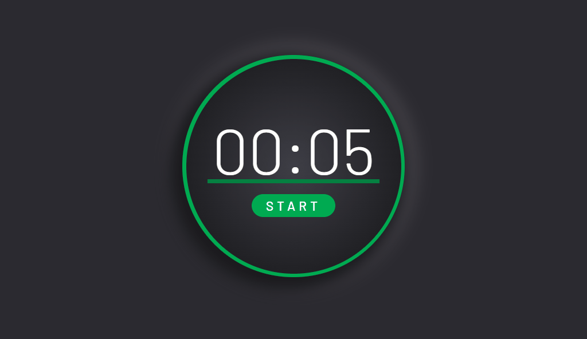

# Pomodoro timer ⏱️

## 💡 Brief

In this project, I developed a Pomodoro timer.

## 📌 Users should be able to:

- Start the timer by clicking on the start link/button.
- Once the user clicks start, the word start will change to stop. Then, the user can click on the stop button to make the timer stop.
- Click on the gear icon to change the length (minutes and seconds) of the timer.
- Once the timer finishes, the ring should change from red to green and an alert message is passed to the browser.

## 🔠 Fonts

- Barlow - https://fonts.google.com/specimen/Barlow?query=Barlow

## 🎨 Colors

- Dark Gray: #2b2a30
- Gray: #3e3e46
- Light gray: #808080
- Green: #00aa51
- Dark green: #058141
- Red: #dc143c
- Dark red: #b91233
- Pink: #ffe1f7

## 🚀 Challenge finished

This challenge was developed with the following languages:

 
 
  &nbsp; &nbsp;

## 🌍 Website

You can try my final result of the challenge [here](https://jaenfigueroa.github.io/Pomodoro-timer).

